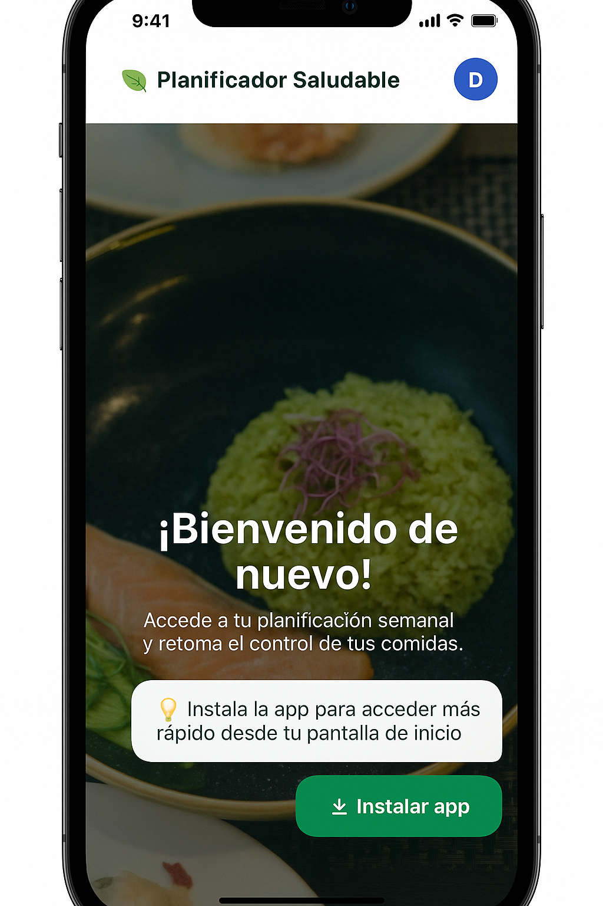

### 🥗 GastroFit — Tu planificador inteligente de comidas

**GastroFit** es una Progressive Web App (PWA) moderna y responsive que te permite planificar tus comidas semanales, llevar el control nutricional y generar menús inteligentes personalizados. Diseñada para optimizar tu alimentación y mejorar tu salud de forma sencilla y visual.

---

### 📲 Demo

  
  

🔗 [gastro-fit-lyx2.vercel.app](https://gastro-fit-lyx2.vercel.app)

> Instálala en tu móvil u ordenador como una app nativa (compatible con Android, iOS y escritorio).

---

### ✨ Funcionalidades principales

- 📆 **Planificación semanal por franjas horarias** (desayuno, comida, cena…)
- 🍽️ **Arrastra y suelta** platos desde una lista para organizar tu menú de forma intuitiva
- 🧮 **Resumen nutricional diario y semanal** con calorías, proteínas, grasas e hidratos
- 💾 **Historial de semanas**: guarda, duplica y reutiliza planificaciones pasadas
- 🧠 **Menú inteligente Adaptado**: genera comidas saludables de forma automática en base a tus requerimientos
- 🔐 **Gestión de usuarios con Firebase**: login, registro y datos guardados por usuario
- ⭐ Marca comidas como favoritas y añádelas fácilmente a tu planificación
- 📱 **100% responsive** y funcional como **PWA** (instalable)

---

### 🧠 Tecnologías usadas

- **Angular 16+**
- **Firebase (Auth + Firestore)**
- **Angular Material**
- **ngx-joyride** (onboarding interactivo)
- **CDK Drag and Drop**
- **SCSS + Flex/Grid Layout**
- **PWA ready**

---

### 📸 Capturas de pantalla

_Añade aquí algunas imágenes de tu app en uso (opcional)_

---

### 📬 Contacto

¿Feedback o sugerencias?  
Puedes escribirme en [tu email o redes sociales].
